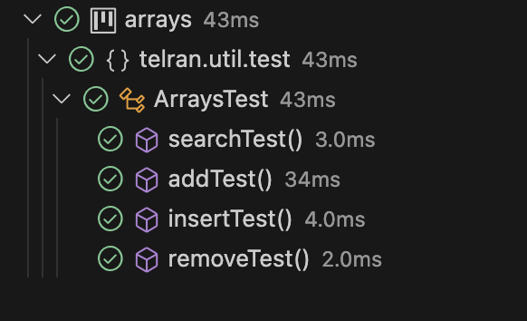

# Arrays

Utilities for working with arrays.

## Methods

**search**

Search element in array.
Return index of element in array.

```java
  int[] arr = new arr[] {9, 3, 6);

  int result = Arrays.search(arr, 3);
  // result = 1

  int result = Arrays.search(arr, 99);
  // result = -1
```

**add**

Add element to array.
Return new array.

```java
  int[] arr = new arr[] {9, 3);

  int result = Arrays.add(arr, 6);
  // result = {9, 3, 6}
```

**insert**

Insert element to array.
Return new array.

```java
  int[] arr = new arr[] {9, 6);

  int result = Arrays.insert(arr, 1, 3);
  // result = {9, 3, 6}
```

**remove**

Remove element from array.
Return new array.

```java
  int[] arr = new arr[] {9, 3, 6);

  int result = Arrays.remove(arr, 1);
  // result = {9, 6}
```

## Test report



